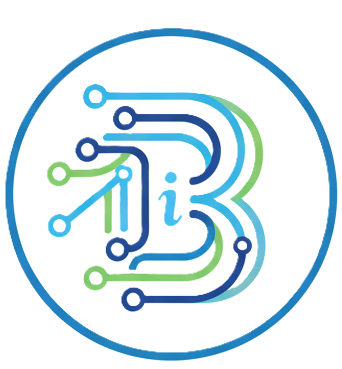

# iBarangay: Digital Barangay Management System

<div align="center">
  
</div>

<p align="center">
  A modern, web-based Barangay Information and Service Automation System designed to streamline community management, document processing, and data analysis for local government units.
</p>

<p align="center">
  
  
  
  
  
</p>

---

## ✨ Key Features

iBarangay is a comprehensive platform built to modernize local governance with a suite of powerful features:

-   **👤 Resident Profile Management:** A complete system for administrators to create, read, update, and delete resident profiles with detailed demographic information.
-   **📄 Online Document Requests:** Residents can request official documents (e.g., Barangay Clearance, Certificate of Residency) through a self-service portal, which auto-fills forms using their stored data.
-   **✅ Document Processing Workflow:** A clear, role-based workflow for staff to verify, approve, mark as paid, and release documents, with real-time status updates for residents.
-   **💳 Digital Payment Tracking:** Supports payment confirmation for document requests, with a system for residents to submit transaction IDs for verification by the treasurer.
-   **🤖 AI-Powered Insights:** Leverages Google's Gemini AI to analyze resident and document data, providing administrators with valuable insights into community trends and patterns.
-   **📈 Custom AI Report Generation:** An advanced tool allowing administrators to generate custom PDF or Excel reports by describing their requirements in natural language.
-   **🔑 Secure Authentication:** Robust login system supporting both traditional email/password and convenient Google Sign-In, with a secure password reset flow.
-   **📄 Dynamic PDF Generation:** Automatically generates official, branded PDF certificates with the barangay's seal, ready for download.
-   **📱 Fully Responsive Design:** A clean, modern user interface that is fully responsive and accessible on all devices, from mobile phones to large desktop monitors.

## 🎭 Role-Based Access Control (RBAC)

The system is built with a sophisticated role-based access model to ensure that users only have access to the information and functionalities relevant to their position.

| Role                | Description & Key Functionalities                                                                                                                                                           |
| ------------------- | ------------------------------------------------------------------------------------------------------------------------------------------------------------------------------------------- |
| **Admin**           | **Super User** with full system access. Manages all aspects of the application, including user accounts, system settings, and all resident/document data.                                     |
| **Barangay Captain**  | **High-Level Oversight.** Views comprehensive dashboards, resident masterlists, document request statuses, and generated reports for strategic decision-making.                               |
| **Secretary**       | **Records & Document Management.** Manages resident profiles (add/edit/delete) and processes document requests (approve/reject/release).                                                      |
| **Treasurer**       | **Financial Management.** Manages and verifies payments for document requests, views financial reports, and tracks revenue.                                                                   |
| **Resident**        | **Self-Service Portal.** Can view their own dashboard, request new documents, track the status of their requests in real-time, and manage their personal profile information.                  |

## 🛠️ Tech Stack

-   **Frontend:** [Next.js](https://nextjs.org/), [React](https://react.dev/), [TypeScript](https://www.typescriptlang.org/)
-   **UI:** [Tailwind CSS](https://tailwindcss.com/), [shadcn/ui](https://ui.shadcn.com/)
-   **Backend & Database:** [Firebase](https://firebase.google.com/) (Authentication, Firestore, Storage)
-   **AI Integration:** [Google AI - Genkit](https://firebase.google.com/docs/genkit) (with Gemini)
-   **Document Generation:** `jspdf` & `html2canvas`
-   **Charting:** `recharts`

## 🚀 Getting Started

To get a local copy up and running, follow these simple steps.

### Prerequisites

-   Node.js (v18 or higher)
-   `npm` or `yarn`

### Installation

1.  **Clone the repository:**
    ```sh
    git clone https://github.com/RyanClaud/ibarangay-project.git
    cd ibarangay-project
    ```

2.  **Install NPM packages:**
    ```sh
    npm install
    ```

3.  **Set up Environment Variables:**
    Create a file named `.env.local` in the root of your project and add your Firebase and AI credentials.

    ```ini
    # .env.local

    # Your Gemini API Key from Google AI Studio
    GEMINI_API_KEY="your_api_key_here"

    ```

4.  **Run the Development Server:**
    ```sh
    npm run dev
    ```

    Open http://localhost:9002 with your browser to see the result.
